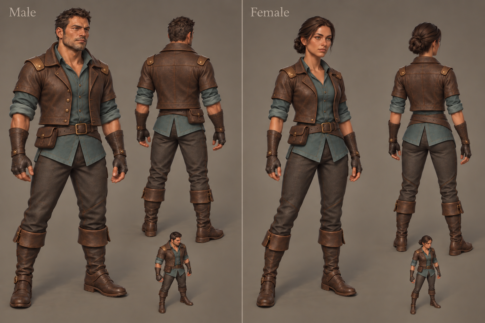

# Protagonist design and production

## Selected direction

The player has two fixed appearances, male and female, with the same gameplay capabilities and Mixamo source-motion choices. Equipped weapons and shields remain visible; armor items do not change the permanent outfit. Character customization, hair physics and cloth simulation are outside this first character pass. This is selected design scope, not implemented character selection.

The original concept was generated with the built-in image tool using only original concept images as references. No licensed model, texture or render was submitted. [Generation provenance](../assets/concepts/protagonists/source.json) records the selected image and prompt. This sheet defines appearance; it does not establish achievable model quality or animation acceptance.

Both are attractive, weathered adventurers around 30, with natural adult proportions, smooth sculptural forms and broad painterly material variation. Blue-green cloth contrasts with warm umber leather, charcoal trousers and restrained tarnished brass. Clothing is cared for and visibly used: softened edges and selective broad wear. The generated sheet's fine leather crackle should not carry into the model.

The male retains the broad, rugged M1 face, original short swept hair and light stubble. His short jacket has a broad turned-down collar, straight opening and squared upper-hip hem. The female retains the composed F6 face, current narrower athletic proportions and compact low hair knot. Her short jacket uses softer collar shaping and a modestly angled hem. Distinguish seams and bracer construction while retaining shared material language. The earlier sleeveless male vest was rejected.

Use short split cloth hems, simple boots, compact bracers, fingerless gloves and one belt with a modest pouch. Keep shoulder protection small. Avoid long loose hair, dangling braids, capes, long coat tails, dense hardware and added emblems or accessories. Hair must look complete following the head without independent physics.

## Foundation review — 2026-10-02

The initial foundations are Mixamo **Brian** (`mixamo-a58c06c4-3307-40e6-a02d-bfcd658bdbff`) and **Megan** (`mixamo-37f11292-3002-46c3-ac53-f773d1a93026`). Use these as technical starting points; their modern outfits and existing faces do not replace the selected designs. Both models and original source FBXs are present locally. Source paths and licensed artifacts remain private under the existing [asset boundaries](ASSET_PREPARATION.md).

The prepared models have separate clothing meshes and exposed forearms. Both have 65-bone rigs with finger chains. Inspection of every skinned primitive found no unweighted vertices, nonfinite weights or invalid active joint indices; weight sums agree with one within approximately 0.00000014. Their existing gallery idle/run/attack clips bind to all 65 target nodes without missing targets. This establishes structural compatibility, not acceptable weapon grips.

Neutral CPU Blender renders inspected the source faces and sampled run/attack poses at 45% of each existing gallery clip. They show usable facial geometry and plausible sampled shoulder/elbow deformation. Megan's existing overlapping hair geometry should be replaced with the selected sculpted knot. These are source inspection renders, not native runtime acceptance or complete-cycle review. The gallery clips are historical samples, not the current curated gameplay profiles.

The models do not contain complete unclothed bodies beneath their garments. Removing clothing leaves missing covered regions. Preserve suitable weighted face/hand/arm geometry; reshape existing clothing or build replacement garments and necessary covered regions, then review transferred weights. Do not assume mesh separation means a complete removable outfit system.

The owned native WebGPU preview was queued behind another task's GPU lease during this review. Native material appearance, full animation cycles and weapon grips remain unverified. Private scripts, renders and the skin audit are retained with the task's source-review evidence.

## Production sequence and acceptance

Build the male first to establish the process, then the female. First compare a neutral geometry draft against the approved front, rear and elevated silhouettes. Refine face, hair and garment construction before texturing. Keep editable sources and derived licensed models private; preserve original archives.

Prepare both rigs through the existing checked Mixamo baker with their own compatible catalogs. Retain curated source selections, trims and contact/release clocks; do not reuse Paladin-baked tracks solely because bone names match. New proportions require reviewed normalization, gait calibration, sockets and grips. See [animation ownership and acceptance](ANIMATIONS.md).

Review the finished surfaces under shared Golden lighting in the native WebGPU pipeline at normal gameplay scale. Exercise sword/shield, axe, bow and staff motions, gathering, dodge, hit and death as relevant to the new art. Inspect hands, shoulders, collar/hair clearance, boot contact and transitions; a build or structural skin audit cannot establish visual quality. Add character selection and persistence only after both appearances are accepted, with an explicit migration preserving existing progress.
