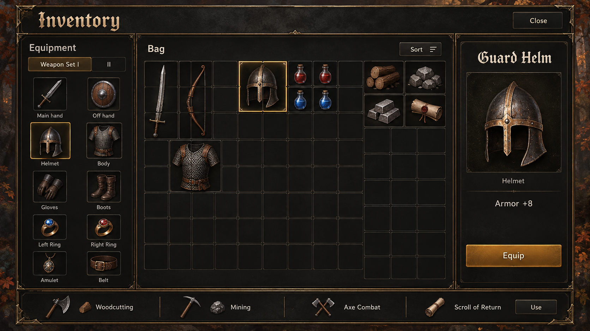
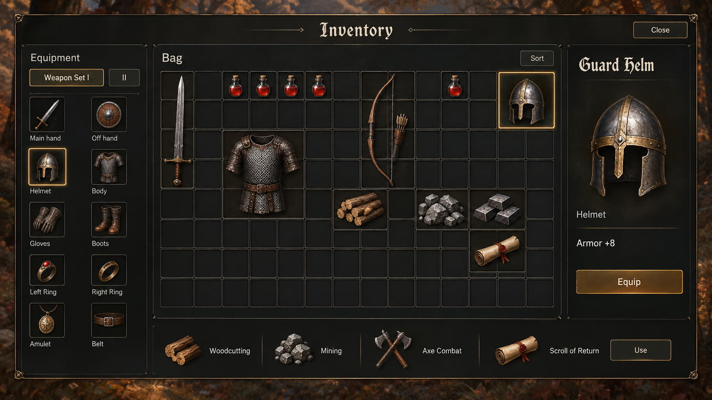
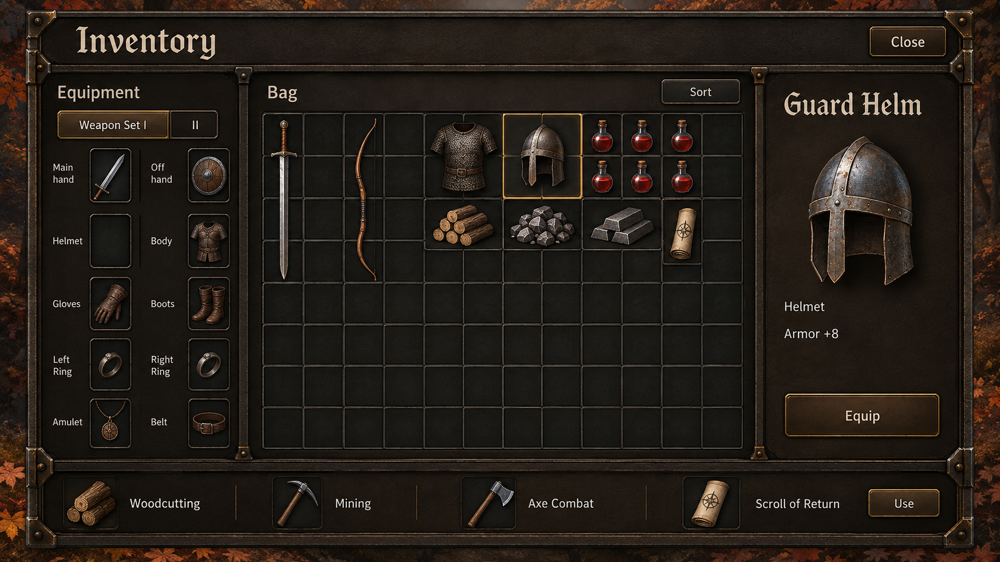

# Inventory direction studies — October 2, 2026

These original mockups compare material weight within the owner's chosen **warm, crafted fantasy with restrained ornament** direction. The same Inventory goal and three-region Equipment / Bag / Details hierarchy were requested in all three. They are concepts for discussion, not runtime screenshots, exact layout specifications or production assets. See [decisions](../DESIGN_DECISIONS.md) and [the design system](../../UI_DESIGN.md).

## Comparison and recommendation

| Concept | Useful direction | Refinement needed |
| --- | --- | --- |
| A — Crafted instrument | Thin brass, coordinated warm surfaces and recognizable fantasy heading/item art; strong selected-item focus | Reduce oversized heading and repeated framing; calm the primary button and use B's lighter reading-surface treatment |
| B — Quiet glass | Less framing, smaller title and quieter controls; clear separation without a heavy decorative shell | Selection glow is too strong; mostly matte output does not establish the requested smoky-glass response; retain stronger Lantern craft at a few joints |
| C — Forged cabinet | Cohesive physical structure, restrained primary action, empty equipped Helmet slot makes selected-item context clearer | Corner joints/dividers dominate and wrapped equipment labels are awkward; reduce structure and give labels more space |

**Historical material selection, October 2, 2026: A — Crafted instrument. Its original organization was not approved.** The owner then requested multiple organizational layouts and a longer design-only phase; that hold was subsequently lifted for the refined Inventory/stash implementation. See the [layout exploration round](inventory-layouts/README.md) and [active design plan](../DESIGN_EXPLORATION.md). Retain A's crafted identity; B's calmer framing/smaller title and C's selective structural joints remain refinement references. None of the three should be traced pixel-for-pixel.

The outputs contain generated drift: multi-cell footprints/grid geometry are inconsistent, several icons are invented examples, A includes blue potions, and A/B imply a selected helmet is also equipped. Some ornament and glow exceed the restraint goal. These images supplied material discussion, not a product feature specification; their footers, inspectors and action rows are now superseded. No generated typography or stat copy is adopted as production data.

**Superseded organizational elements:** the owner subsequently rejected the unrelated gathering/proficiency/return-scroll footer, enlarged item art, persistent item selection/inspector, redundant category labels and extra action/instruction text. The requested replacement is a silhouette paper doll with surrounding equipment slots, equal artwork scale, hover name/useful-property tooltips, icon controls and direct item actions. These initial images remain material-reference history only; they are not an approved layout or feature list. Current direction lives in the [paper-doll layout studies](inventory-layouts/README.md).

## A — Crafted instrument

[Exact prompt A](inventory/a-prompt.md). Built-in ImageGen; text only; no reference image.

## B — Quiet glass

[Exact prompt B](inventory/b-prompt.md). Built-in ImageGen; text only; no reference image.

## C — Forged cabinet

[Exact prompt C](inventory/c-prompt.md). Built-in ImageGen; text only; no reference image.

## Provenance

All three PNGs are 1672 × 941 pixels, copied unchanged from built-in ImageGen outputs. No Synty/Mixamo model, texture, render, game screenshot or third-party reference was supplied. These files live in documentation, outside `public/` and runtime imports. Original content follows the [project license](../../../LICENSE.md). The precise prompts above preserve requested content and each variation.

| File | SHA-256 |
| --- | --- |
| `inventory/a-crafted-instrument.png` | `932dd09d899f848bdfdd968edbd8845b48f69b49afa3ac88cba396f30bbb6e92` |
| `inventory/b-quiet-glass.png` | `8d6e2259a916b7db2e89dad1480efc4db24ca3c9b342e68f553eb0ff75e58f27` |
| `inventory/c-forged-cabinet.png` | `c4159aafb5150ab93cdc07e45323dfa7f85682e3c539afdc09a63c750fb477c4` |

The [Inventory brief](inventory/BRIEF.md) records the player goals and current rules to preserve across alternative layouts. Later organizational/hierarchy and interaction studies led to the implemented Inventory/stash; [the screen catalog](../SCREEN_CATALOG.md) owns current evidence. The original prompts/images here remain unchanged. No gameplay, responsive, accessibility, controller or cross-platform inspection was performed in this concept task.
