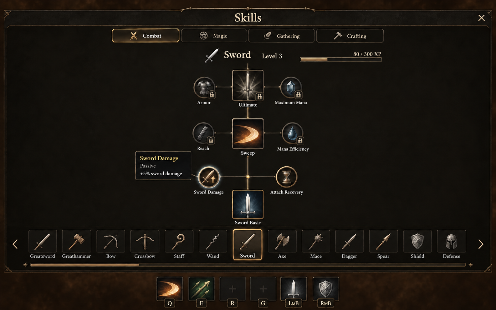
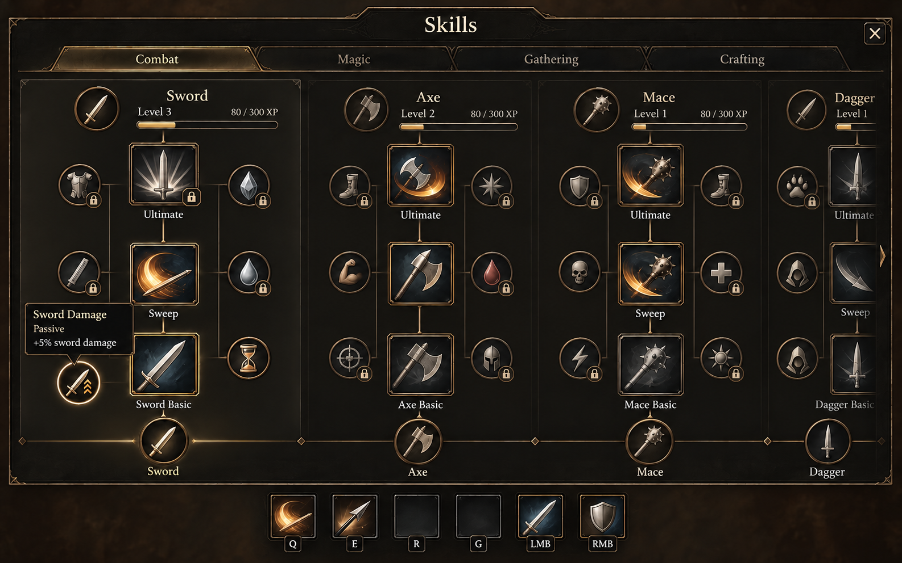
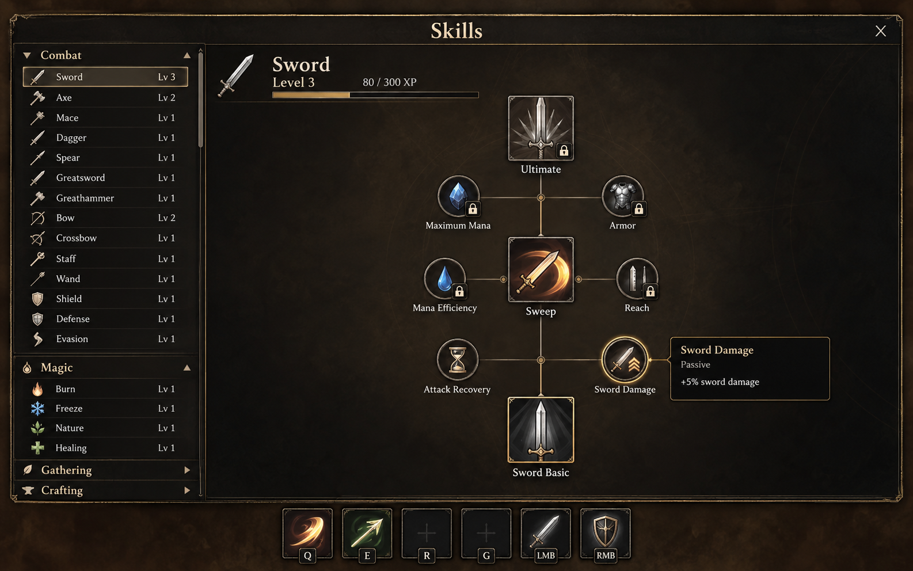
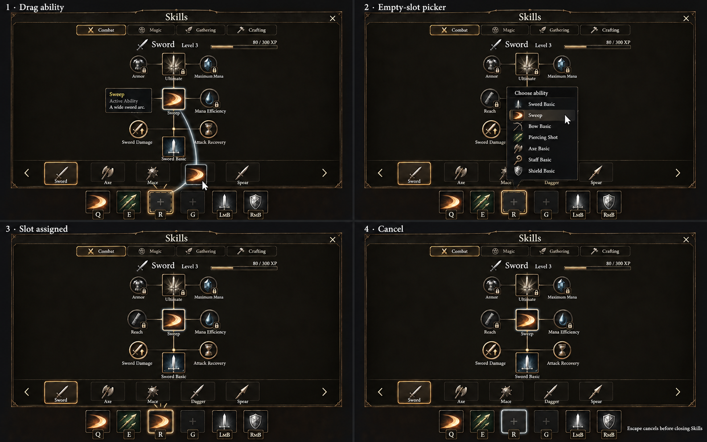
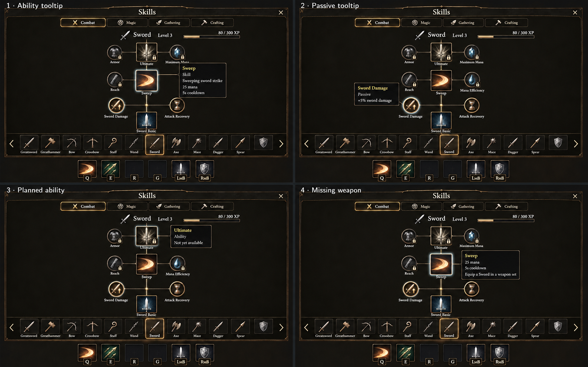
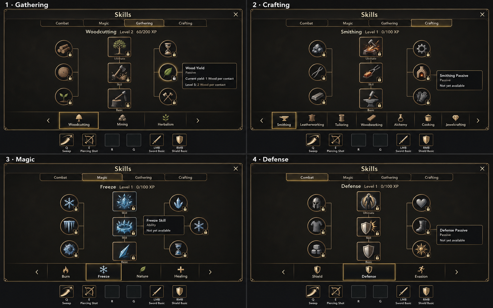

# Skills — upward nodes and external action-bar assignment

**Superseded:** owner selected [the horizontal six-step layout](../../skills-horizontal/README.md), a complete active-category skill row, a level ruler without XP bars and generic profession nodes. These upward studies remain historical provenance.

October 2, 2026. This is the active concept round, superseding [the first round](../skills/README.md). Original built-in ImageGen output only; no runtime, save or XP gameplay changes. See the [brief](BRIEF.md), [design system](../../../../UI_DESIGN.md) and [decisions](../../../DESIGN_DECISIONS.md).

## Owner-selected changes

- Make Skills as substantial as the Inventory/Equipment sheet, occupying most of the screen.
- Remove the in-panel Assigned Abilities section. Keep the actual gameplay action bar visible and reachable below the menu.
- Drag an unlocked assignable ability node to that bar, or click an empty bar slot for a list of available abilities.
- Every skill has larger ability nodes (Basics, Skills, Ultimates) and smaller passive-bonus nodes. Every individual node has its own icon, including future/locked nodes.
- Hover or keyboard focus supplies node information. Passive nodes are effects, not action-bar assignments.
- Explore skill root icons along the panel bottom with linear progression growing straight upward. Bottom-root navigation is a proposal being compared, not an adopted final layout.

The [28-track roster](BRIEF.md#roster) remains unchanged. Concepts use illustrative Sword level/XP and passive examples; none establishes rewards or balance.

## Compare the layouts

| Variant | Organization | Strength | Tradeoff |
| --- | --- | --- | --- |
| A — Bottom roots, one selected tree | Category controls, browsable root strip, selected skill centered with one upward tree | Calm, focused browsing with ample tooltip room | Recentring/reordered roots can make navigation less stable; select a fixed ordering in implementation |
| B — Bottom roots, parallel trees | Several adjacent root/tree lanes; horizontal browsing moves roots and trees together | Most directly expresses each skill growing upward from its own icon | Dense categories require horizontal browsing; fewer lanes fit at the minimum viewport |
| C — Grouped list, upward tree | Named skill list beside one upward progression canvas | Names remain easy to scan across 28 skills | Uses more navigation width and less closely follows the bottom-root idea |

Recommendation: B best expresses the owner's latest idea; A is a quieter alternative. No layout has been adopted. For B, keep one root/tree scroll relationship and never squeeze all 28 lanes into one view.

### A — Bottom roots, selected tree

[Exact refinement prompt and input hash](01-bottom-roots-selected-tree-refined-prompt.md). Root alignment was corrected after the [initial output](01-bottom-roots-selected-tree.png); [original prompt](01-bottom-roots-selected-tree-prompt.md).

### B — Parallel upward trees

[Exact direction-correction prompt and input hash](02-bottom-roots-parallel-trees-refined-prompt.md). Basic is now nearest the root, Skill above, Ultimate highest. The [initial draft](02-bottom-roots-parallel-trees.png) reversed that order and is superseded; [original prompt](02-bottom-roots-parallel-trees-prompt.md).

### C — Grouped list and upward tree

[Exact prompt](03-grouped-list-upward-tree-prompt.md). Comparison reference; the generated root icon is omitted and passive labels are more persistent than intended. The final UI needs a clear root and hover/focus details, not a persistent inspector.

## Interaction studies

### Drag to the real bar, empty-slot picker, assignment and cancellation

[Exact corrective prompt and visual input](04-drag-and-slot-picker-refined-prompt.md). Picker offers existing assignable abilities across families and excludes passive/future nodes. Assigning Sweep to R leaves Q intact; cancellation changes nothing. The refined sheet removes invented skills/names from the [rejected first draft](04-drag-and-slot-picker.png); [original prompt](04-drag-and-slot-picker-prompt.md).

Remaining generated artifacts: the drag motion trail is only a storyboard cue, not a shipping effect; selected-root/tree positions drift between miniatures; one lower passive is omitted in the drag panel; the picker obscures some tree content. Production placement should anchor the popup to the actual targeted slot, keep that slot visible and preserve the tree/layout while it opens. Screen captions are outside-game design notes.

### Ability versus passive tooltips, planned nodes and compatibility

[Exact corrective prompt and visual input](05-node-tooltips-and-locks-refined-prompt.md). Larger square abilities and smaller circular passives each keep their own art. Locked art remains visible beneath a tiny badge; missing equipment does not mean an ability is unlearned. The [first draft](05-node-tooltips-and-locks.png) invented navigation entries and rank dots and is superseded; [original prompt](05-node-tooltips-and-locks-prompt.md).

The example +5% Sword Damage is representative tooltip content only. Passive names, amounts, timing and unlock thresholds remain unimplemented. Tooltips require actual bounds/focus behavior later; miniatures cannot certify readability.

### Gathering, crafting, magic and defensive tracks

[Exact prompt](06-all-skill-node-states-prompt.md). Woodcutting, Smithing, Freeze and Defense illustrate the same two node types. The external gameplay bar remains unchanged while browsing noncombat tracks. Proposed profession actions and defensive abilities are placeholders, not new mechanics or an available ability list.

Generated artifacts: the Freeze top node says Skill rather than Ultimate; some passive pictograms resemble each other; the Wood Yield node carries a lock despite its tooltip describing an existing automatic benefit. Actual existing yield behavior must not become locked or manually purchased. Wood yield values describe base-yield-1 level-1 resources only.

## Boundaries and acceptance

- Root icons navigate skills. Ability nodes describe actions. Passive nodes describe bonuses. Gameplay bar slots assign actions. Keep these four meanings visually distinct.
- Preserve all 28 exact names. Partial/category views do not remove tracks. Invented labels from rejected drafts are not product requirements.
- There is one gameplay action bar outside the Skills sheet, never an internal duplicate. The mockups crop unrelated HUD utilities to keep the design question focused; they do not authorize removing potions, scrolls or weapon-set controls.
- Category tabs, selected-tree versus multiple-tree browsing, final lane density and root order remain layout decisions. Browsing must never modify assignments.
- Natural upward order is root, Basic, Skill, Ultimate. Short side connectors show nearby passive progression, not a points-spending system or selected prerequisites.
- Sizes target 64px ability art and 28px passive art with at least 40px passive hit areas. Generated art is approximate and passives remain oversized in some studies.
- Concepts use plausible future states, not the initial implementation's live XP capabilities. Unavailable XP sources and planned nodes must be represented truthfully.
- No raster concept is imported by runtime. Generated text, icon identity drift, glows, approximate bar lengths, repeated neighboring XP and badges are not source-of-truth data.
- Every retained image has exact prompts, date, built-in tool provenance, output SHA-256 and original-generated input hashes where applicable. No licensed art was submitted.
- Static concept inspection, links/hashes and diff review are the handoff evidence. Input, contrast, actual 1280 × 800 fit, animation, cross-platform behavior and runtime saves are unverified.
