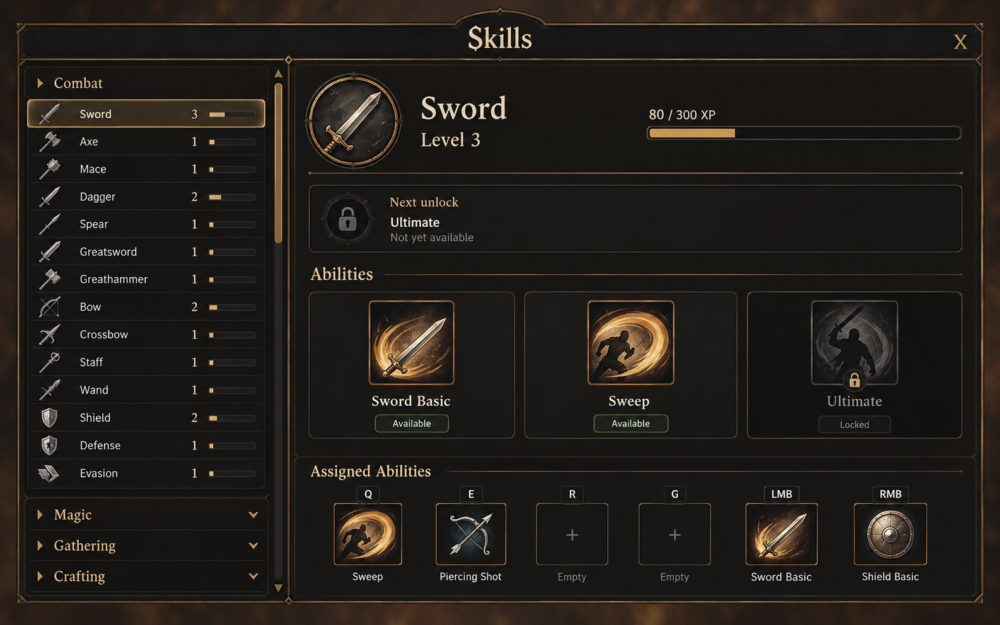
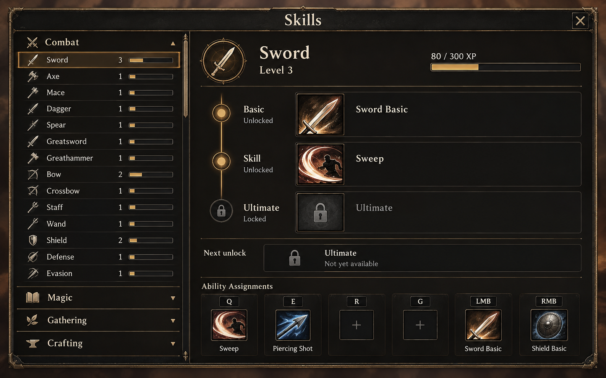
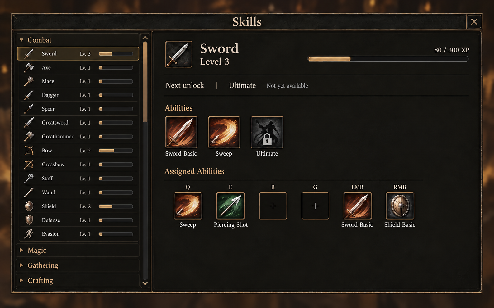
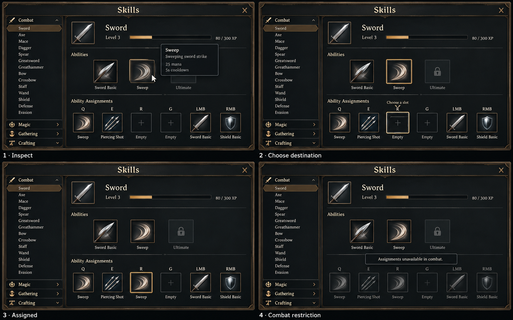
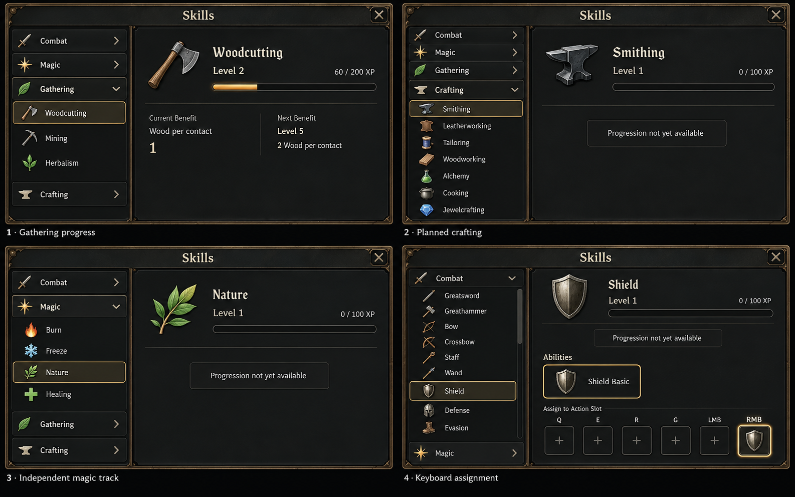
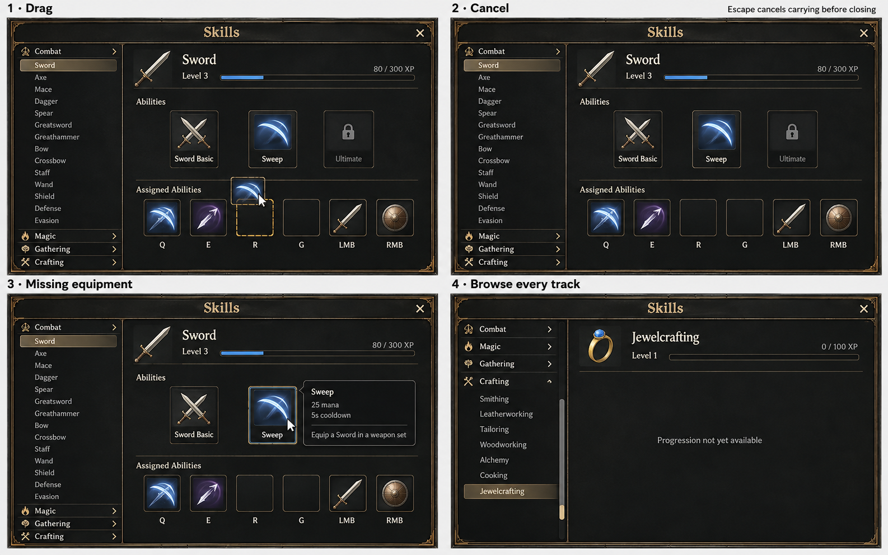

# Skills — layout and interaction concepts

**Superseded first round:** the owner removed in-panel assignment and requested ability/passive nodes with an Inventory-sized sheet. Use [the adopted horizontal gallery](../../skills-horizontal/README.md); images below remain historical provenance, not current interaction requirements.

October 2, 2026. Original built-in ImageGen studies requested by the owner. **Concepts only: no gameplay, saves, experience sources or runtime UI changed.** See the [brief](BRIEF.md), [design system](../../../../UI_DESIGN.md) and [decisions](../../../DESIGN_DECISIONS.md).

## Agreed design foundation

Progress and the next useful unlock lead the screen. Grouped navigation sits beside selected-skill detail. Planned tracks remain inspectable with honest unavailable-progression presentation. Ability icons use hover/focus details; select an ability then its destination among six shared action slots, with drag and keyboard equivalents. Magic and weapon practice are independent future tracks. The [brief](BRIEF.md#roster) retains all 28 owner-selected names.

All three layout variants use the same Sword state, existing Basic/Sweep, locked Ultimate placeholder and six bindings. Level/XP and other representative progression values are illustrative, not new balance or implemented XP sources. No variant is adopted yet.

## Compare the layouts

| Variant | What it explores | Keep | Refine |
| --- | --- | --- | --- |
| A — Master sheet | Broad horizontal progression/ability workspace, bottom assignment strip | Strong scan order, clear available versus locked ability identity | Remove redundant green Available pills, reduce oversized art and card framing |
| B — Progression spine | Ordered Basic / Skill / Ultimate sequence beside ability rows | Unlock sequence is explicit | Duplicated Ultimate/next-unlock information, oversized rows and glowing nodes |
| C — Compact workbench, refined | Compact ability cluster and nearby assignment shelf | Quiet named tiles, slim next-unlock row, restrained frame | Broad empty lower/right space; navigation and icons still exceed intended sizing |

Recommendation for discussion: A's hierarchy with C's quieter ability treatment. This is a recommendation, not an owner decision. DOM sizing and useful responsive behavior must be resolved in the functional screen.

### A — Master sheet

[Exact prompt and provenance](01-master-sheet-prompt.md).

### B — Progression spine

[Exact prompt and provenance](02-progression-spine-prompt.md).

### C — Compact workbench, refined

[Exact edit prompt and input hash](03-compact-workbench-refined-prompt.md). The [initial C output](03-compact-workbench.png) and [its original prompt](03-compact-workbench-prompt.md) remain as provenance; that draft was too similar to A.

## Interaction sheets

### Inspect, select, assign and combat restriction

[Exact prompt](04-assignment-interactions-prompt.md). Useful: localized tooltip, distinct selected ability/destination, no mutation until assignment, duplicate assignment retained, browseable combat restriction. Generated limitations: mini-screen navigation is too dense, and later panels change some surrounding composition. Keyboard semantics, invalid destinations, focus return and runtime combat restrictions remain functional work.

### Gathering, planned crafting, magic and keyboard focus

[Exact prompt](05-track-states-prompt.md). Useful: noncombat details omit irrelevant action slots; planned Smithing and Nature show no fabricated rewards; all seven Crafting and four Magic names appear. Woodcutting values describe base-yield-1, level-1 resources only, not a universal yield promise. Generated limitations: larger emblem art, unnecessary outlined unavailable-state boxes, weak focus/selection distinction and miniature labels. The Shield panel empties unrelated assignments for illustration; selecting another track must not clear the player's bar.

### Drag, cancel, equipment compatibility and full-list browsing

[Exact prompt](06-drag-cancel-compatibility-prompt.md). Useful: destination stays unchanged during drag, Escape first cancels carrying, missing equipment is separate from locked learning, Jewelcrafting remains reachable. **Use for interaction structure only:** ImageGen introduced blue XP/effect accents and white exterior gutters despite the warm palette request. Do not adopt that color/material drift or interpret its stylized Sweep icon as a new magical effect.

## Production boundaries and review

- Original raster concepts stay here, outside public assets and runtime imports. No licensed screenshots or models were inputs.
- Every retained image has an exact prompt, date, tool, input provenance and SHA-256 beside it. C's refinement references only its original generated UI image.
- All 28 tracks exist in the design brief; collapsed/scrolled navigation means they do not all appear in one screen.
- Level bars are approximate; any mismatched lengths, arbitrary nonselected levels, exaggerated lock art, icon identity drift, duplicate labels or new framing are generated artifacts, not gameplay rules.
- The Sword main-state mockups illustrate a future progression display. Its eventual initial implementation must honestly indicate that Sword XP earning is not yet available while existing abilities remain assignable.
- No new unlock thresholds, XP sources, recipes, general character level, equipment proficiency gates or class restrictions are established.
- The contact sheets compress full screen states for discussion. They do not prove 40px hit areas, contrast, 1280 × 800 fit, keyboard behavior, animation quality or accessibility.
- Reviewed as static concept art; no gameplay preview, full suite or performance benchmark was needed. Sanity/link and diff review are the concept handoff gate.
