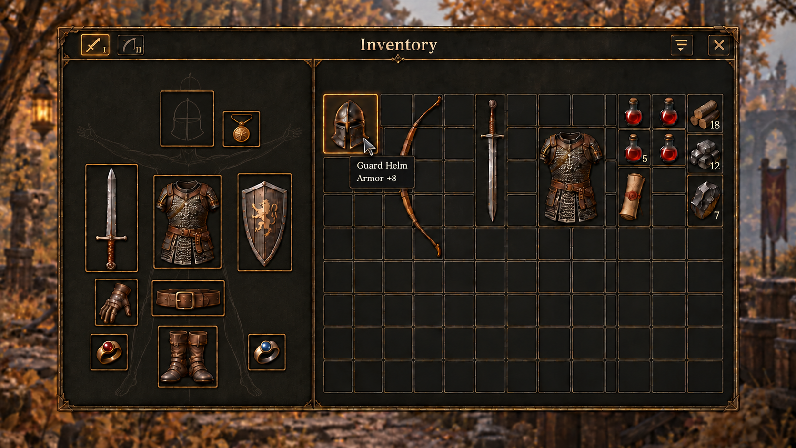
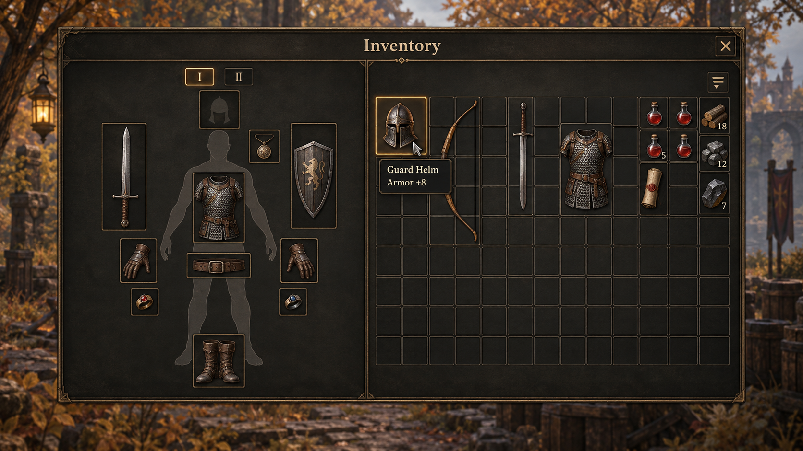
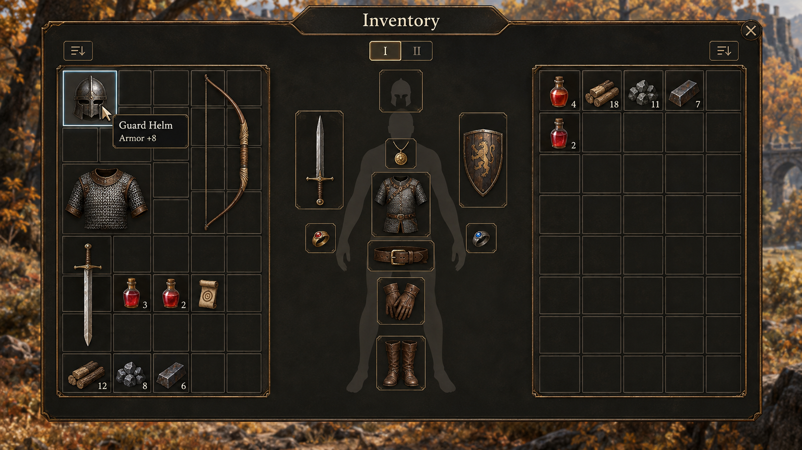
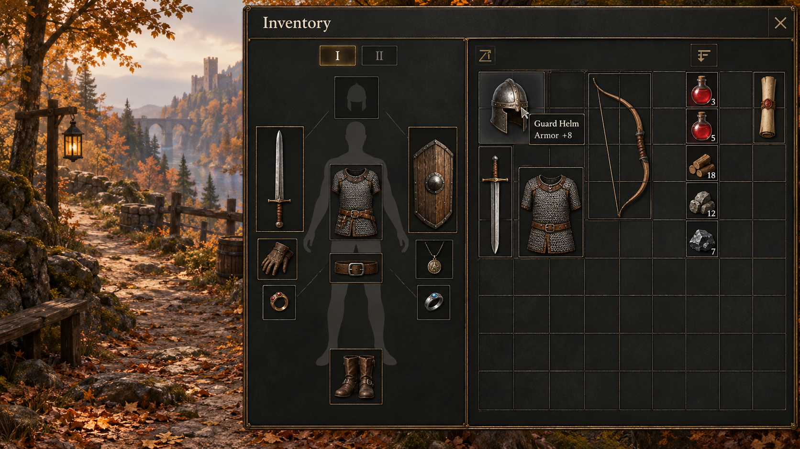
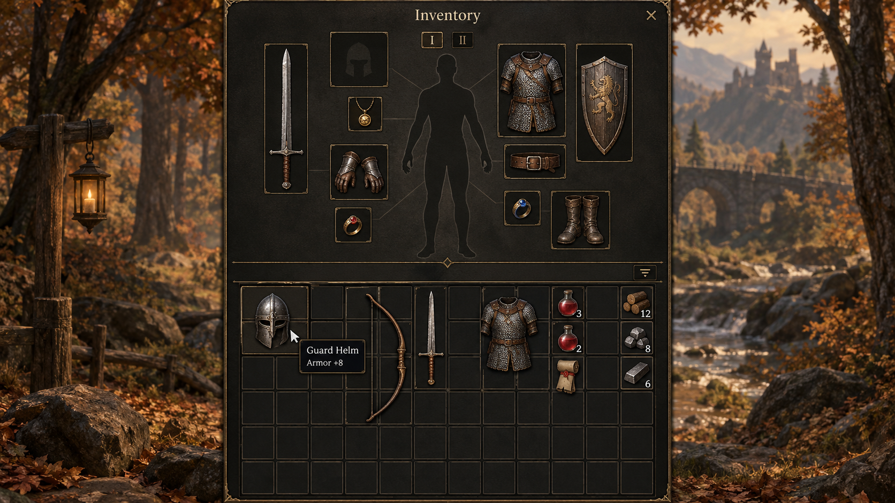
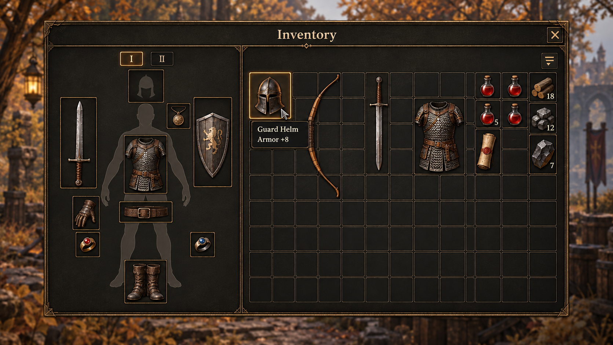
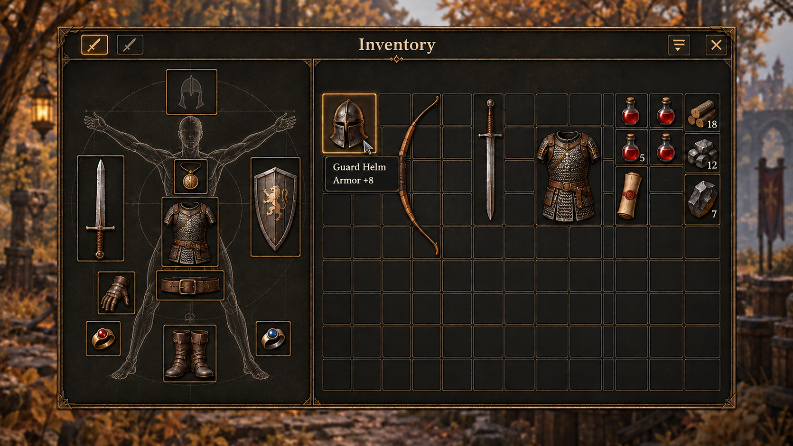
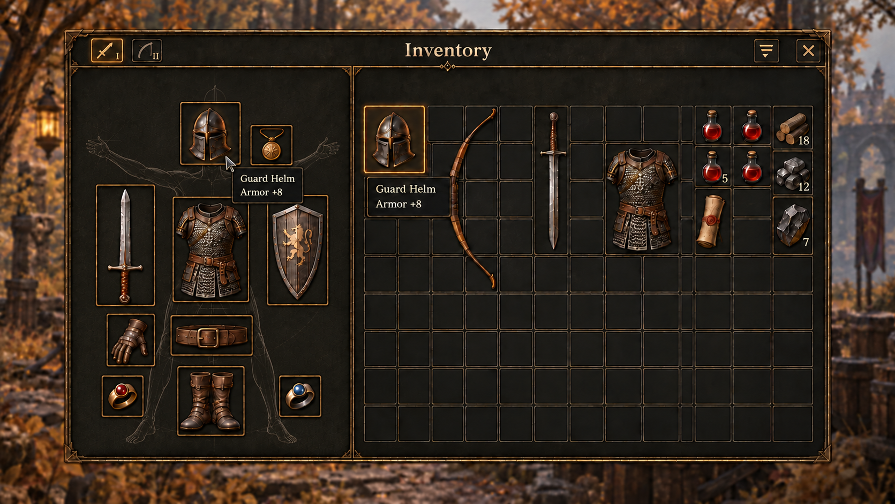

# Inventory layout exploration — paper doll and spatial items

Historical layout round, October 2, 2026. No prototype was built during this round; the owner subsequently authorized the refined Inventory/stash, now recorded in [the screen catalog](../../SCREEN_CATALOG.md). These studies use A — Crafted instrument materials. The owner preferred **#1 as closest: one large split panel, 40% equipment left / 60% inventory right, subtle outline glyphs in empty slots**. Detailed composition/hierarchy remains open. See the [brief](../inventory/BRIEF.md), [decisions](../../DESIGN_DECISIONS.md) and [exploration plan](../../DESIGN_EXPLORATION.md).

## Constant design intent

The owner chose loadout/quick gear exchange as the priority, with equipment and bag visible together, spatial items with different footprints, and hover tooltips containing name/useful properties only. A flat illustrated person silhouette anchors surrounding equipment slots. Each item keeps one artwork scale across bag/equipment/carry; no enlarged preview or persistent selection/inspector. Controls use recognizable icons; item actions are direct. No unrelated gathering/proficiency footer, separate return-scroll section, redundant category, automatic comparison, action row or instructional copy.

The generated images explore that intent but do not establish exact cell geometry, pixel parity or usable interactions. Bag dimensions/capacity, precise slot positions, final icon art and whole-UI scale remain design questions. Images generated earlier in the conversation with footers/inspectors were superseded before this round; they are not carried forward as layout requirements.

## Latest composition checkpoint

[Exact prompt and input provenance](09-quiet-grid-prompt.md). This incorporates the owner's compact grid-like slots and quiet rough background figure, toolbar controls and single useful hover tooltip. Equipment is the foreground focus. It corrects the populated-helmet and duplicate-hover artifacts of study 8. This remains an exploratory composition; exact art scale, storage geometry, responsive behavior and interaction specification need further design work. No prototype was built.

## Organizational tradeoffs

| Family | Player-facing emphasis | Design question / weakness to resolve |
| --- | --- | --- |
| 1 — Twin folio | Paper doll and one continuous bag occupy balanced adjacent regions; both remain easy to reference during gear exchange | How compact can the equipment orbit become while item art retains the bag's scale? |
| 2 — Central loadout | The silhouette/equipment is central; carried items flank it in two wings | A split spatial bag needs a deliberate compartment/topology decision and may make organization less straightforward |
| 3 — Docked companions | Adjacent equipment/bag workspace attaches to a screen edge, retaining a window onto the world | Determine useful world exposure and compact reflow without reducing item art; background interaction/pause needs its own design choice |
| 4 — Stacked kit | Equipment appears above one continuous bag on a tall central sheet | Study short-window behavior and vertical reach; item scale must remain constant when reflowing |

**Owner preference:** develop 1 as a single large split panel, equipment left and bag right. Further exploration concerns region proportions, density, anatomical slot placement, tooltip/direct-action behavior and compact reflow. Other families remain reference alternatives. This preference is not implementation authorization or evidence of faster use.

## 1 — Twin folio

[Exact prompt](01-twin-folio-prompt.md). Useful: simultaneous equipment/bag, useful two-line hover tooltip, icon close/sort and no inspector/footer. Refine: the output duplicates glove receptacles instead of one glove-pair slot; some art bounds/grid dimensions drift. Bring item-art scale to one exact ruler in later static refinement.

## 2 — Central loadout

[Exact prompt](02-central-loadout-prompt.md). Useful: loadout is the unmistakable focal region and both bag wings remain visible. Refine: gloves sit too low rather than near the hand; hover acquired an unrequested blue edge, and art/footprint proportions vary. The two-wing bag is a design hypothesis, not the current storage model or a new stash.

## 3 — Docked companions

[Exact prompt](03-docked-companions-prompt.md). Useful: clear screen-edge attachment, retained world context and a compact hover tooltip. Refine: the generator changes grid dimensions, adds an unexplained diagonal control and places the amulet too low. Remove the extra control, improve anatomical association and settle one art-scale ruler.

## 4 — Stacked kit

[Exact prompt](04-stacked-kit-prompt.md). Useful: explicit vertical loadout-to-bag organization and minimal controls. Refine: weapon and armor artwork in equipment is larger than corresponding bag art, violating the adopted scale rule; grid shape drifts and some slots lose anatomical association. This image is an organizational alternative, not accepted art sizing.

## Preferred split-panel refinements

### 5 — Proportions and slot count

[Exact edit prompt](05-split-refinement-prompt.md). Input was original concept 1. Useful: larger bag half, one glove receptacle, no unrelated footer/inspector. Still imperfect: frame proportions and art scales are approximate; the empty helmet glyph remained filled rather than outline. The subsequent sketch/toolbar pass replaces this treatment.

### 6 — Artistic sketch, compact cluster and toolbar

[Exact edit prompt](06-sketch-toolbar-prompt.md). Input was original refinement 5. Useful: original hand-drawn figure, clearer compact slot orbit, outline helmet glyph and unified toolbar; no rendered character. Refine: weapon-set icons are identical instead of conveying set identity, and item-art scales/grid geometry still need an exact static-design pass. This is a current composition reference, not a finished asset or prototype.

### 7 — Main-hand glyphs and stable set badges

[Exact edit prompt](07-set-icons-prompt.md). Input was original study 6. Useful: set identity is clear without full text labels; sword/bow are representative example loadouts, not new defaults. The owner subsequently requested tidier grid-like slots and a less detailed, quieter background sketch.

### 8 — Grid-like slot placement, correction needed

[Exact edit prompt](08-grid-sketch-prompt.md). Input was original study 7. Useful: stronger shared columns/rows and foreground equipment hierarchy. Rejected artifacts: the generator populated the empty helmet receptacle and showed two cursors/tooltips. These are not product behavior or approved content. The next correction restores one bag hover and an empty glyph, and quiets the sketch further.

## Provenance and next questions

Built-in ImageGen on October 2, 2026. Layouts 1–4 were original text-only generations at 1672 × 941; edits 5–9 are 1671 × 941 and referenced only original generated UI images listed in their prompt records. No Synty/Mixamo art or private gameplay capture was supplied. All copies are unchanged and retained outside runtime/public imports. Original content follows the [project license](../../../../LICENSE.md).

| File | SHA-256 |
| --- | --- |
| `01-twin-folio.png` | `e0d3024d3af789b2ed2090dd6af92d1b99017cff28fe8ecb354ba512904f0aeb` |
| `02-central-loadout.png` | `a339d72e460905b6846ad2136a2d1d497bf4fdf14f1f1056f7c0a3393773eeb8` |
| `03-docked-companions.png` | `1ab06c4fe9d72b66480eb32ca9001f61c8f8d520c51337b751e364eddd49f5eb` |
| `04-stacked-kit.png` | `86fd6ed1bbd54469c698c466a7860c05b612fe9fd1077a4269f86cdea24194bd` |
| `05-split-refinement.png` | `0cd5b87d941dfc1f291c567d592195ec07140ec74cf4b1a18fc9870e6ad080aa` |
| `06-sketch-toolbar.png` | `a518ded93b5227ba8432e051867ff5f7b55b01d796c65680099658fbbbf66255` |
| `07-set-icons.png` | `a379c9b6f1d086cea820fe2dfdb31565c39f71231b04bc1319e5bf2d0f7e622f` |
| `08-grid-sketch.png` | `e26ef25d86a025033577696537487b79e25309bf22634471bcf09999defa6ebb` |
| `09-quiet-grid.png` | `7d9d09c028df47c8c25b591822dc8fd3a8786dc166e52e5f32d3f21e59b7fc59` |

Follow-up choices: 40% equipment / 60% inventory, grid-like compact slots around a faint rough Vitruvian-inspired background sketch, outline empty glyphs, toolbar weapon glyphs with tiny I/II badges and sort/close icons, direct right-click/drag, automatic ring destination and replaced-gear return. Set viewing/activation, detailed art/slot/interaction and responsive studies remain open. No prototype, gameplay review, accessibility certification or performance measurement belongs to this round.
