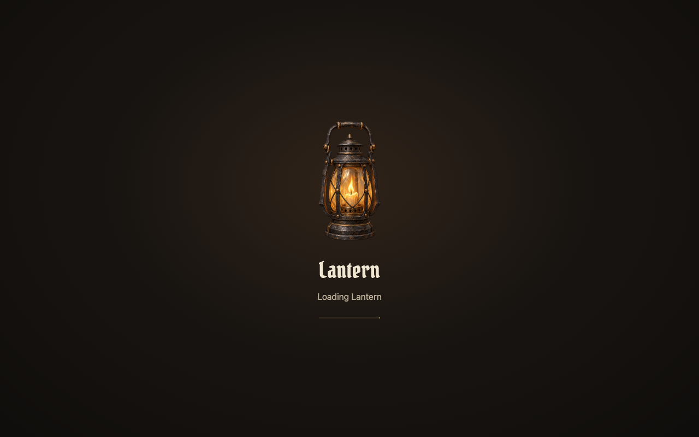

# Loading screen

Adopted October 2, 2026: one stationary original iron/brass lantern in warm darkness, live ivory title and quiet indeterminate feedback. Startup appears immediately; travel uses a short fade and reveals this composition after 400ms only if preparation continues. No minimum loading duration, percentages, tips or lore.

## Brief

Player goal: enter a settled game scene, understand preparation is ongoing, or recover from a failed load. Entry is app initialization or an actual area journey. Exit is two successfully rendered destination frames followed by the reveal, or source-scene restoration after failed preparation.

Hierarchy: lantern silhouette, Lantern title or authored destination name, Loading status. Error states replace heading/status and supply Reload or Retry/Back plus diagnostic export. Essential outcomes are visible without sound. There is no cancel control during preparation.

Input: game content is inert; simulation, menu shortcuts and gameplay audio remain paused through reveal. Recovery controls are keyboard/mouse accessible; focus returns to the canvas after readiness or Back. Reduced motion removes flame variation, indicator movement and fades. Layout targets 1280 × 800 and common desktop proportions.

## Composition study and provenance

`composition.png` is an owned browser capture at 1280 × 800 of the fully opaque DOM loading surface, composed from original ImageGen artwork and live text/CSS. It contains no licensed world art. Captured October 2, 2026. SHA-256: `151e28a78a50a5bac428a4acd8be570789af4b6190028180b88e98aca61d6a4e`. This layout study is retained outside runtime imports. Production artwork, exact prompt and SHA-256 are recorded in [the asset provenance](../../../../assets/ui/loading/PROMPT.md). No input images were supplied to ImageGen.

Critique: clear focal silhouette, quiet material treatment and enough breathing room. The thin indicator communicates ongoing work without suggesting a measured percentage. Artwork cannot establish actual readiness; the coordinator supplies that signal. Error buttons use the same restrained materials with explicit focus treatment.

## Owners and inspection

[Controller](../../../../src/ui/loading.ts), [styles](../../../../src/ui/loading.css), [HTML shell](../../../../index.html), [entry](../../../../src/entry.ts) and [coordinator](../../../../src/clearing/clearing.ts) own presentation and lifecycle. The existing frame loop propagates rendered-frame failures to readiness waiters.

Inspected in one owned normal-settings native WebGPU/FSR preview: startup, 1280 × 800 composition, menu-shortcut suppression, stale operation protection, missing required character art, actual portal travel failure, Back to source, and Retry through delayed preparation to Homestead. Controlled failure/delay lived only in the inspection browser; no production delay or fixture route exists. Reduced-motion behavior and quick-transition suppression are inspected separately in that session. Full local suites, benchmarks and other platforms are outside this task.

One focused frame-loop regression protects startup/travel from hanging after a render exception. Existing checks did not exercise rejected frame readiness; a deterministic scheduler fixture verifies rejection without a GPU/browser dependency.
