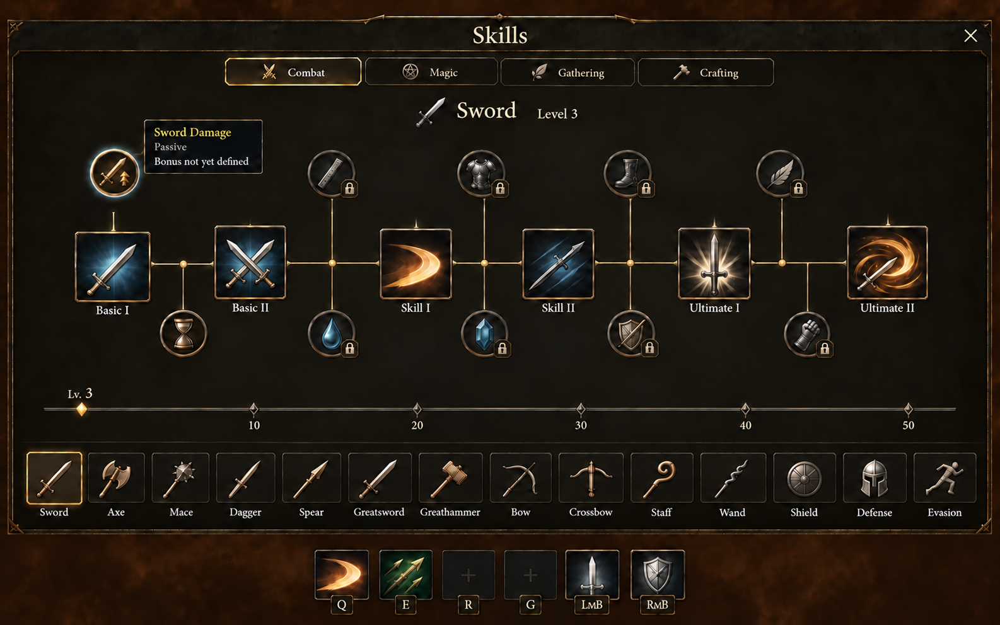
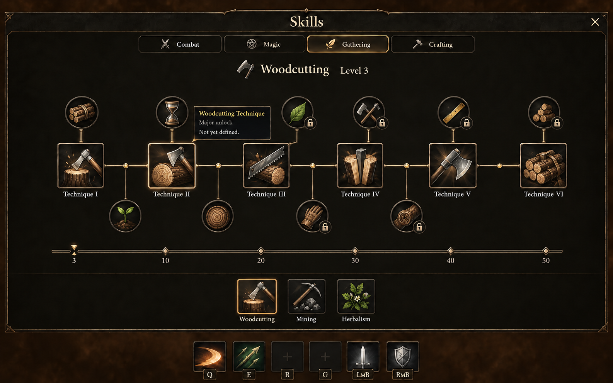
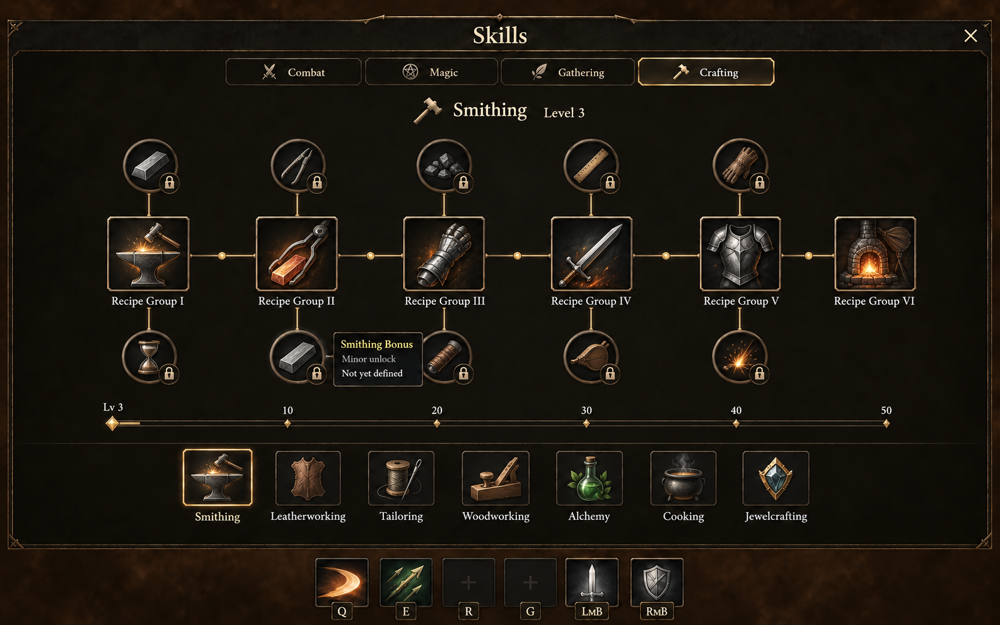
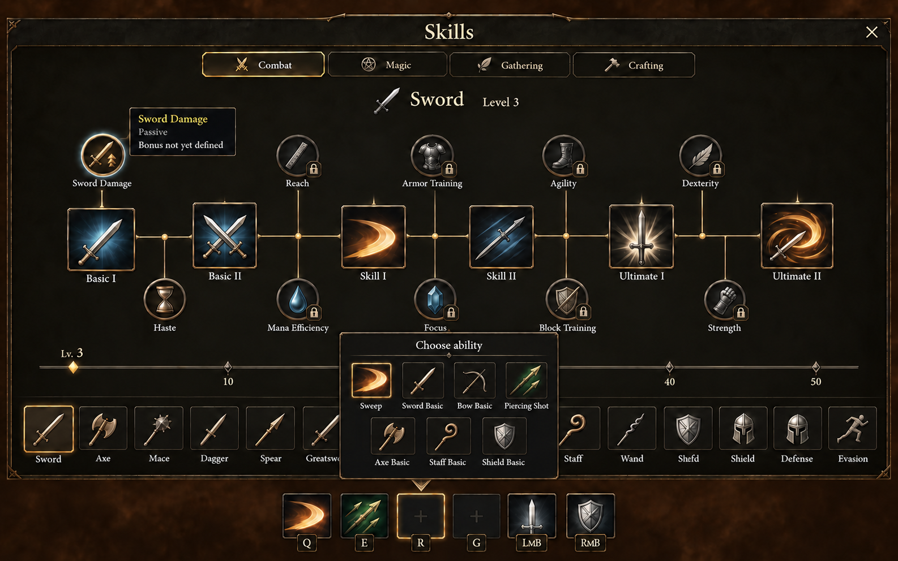

# Skills — adopted horizontal progression

October 2, 2026. The owner selected the six-step horizontal layout and authorized implementation. This round supersedes [upward-tree studies](../skills-nodes/README.md). [Screen/data brief](BRIEF.md) owns the selected structure and implementation scope.

## Locked direction

Four category tabs at the top; every skill in the active category visible at once in a bottom icon row; a left-to-right selected tree in between. Combat and Magic have at least two Basics, two Skills, two Ultimates and ten smaller passive nodes. Two passive nodes sit between each adjacent pair of major nodes. Every node has its own icon and hover/focus information.

Gathering and Crafting share the six-major/ten-minor layout but use generic Major/Minor placeholders, not Basic/Skill/Ultimate actions. The selected skill's level ruler sits immediately above the skill row, marking 10, 20, 30, 40 and 50, without an XP bar. One actual action bar stays outside the sheet; drag available actions to it or activate an empty slot for its picker.

### Adopted six-step reference

[Exact final correction](02-six-step-path-final-prompt.md). This has six large and ten small nodes; all fourteen Combat names appear exactly once. The source [first version](02-six-step-path.png) / [prompt](02-six-step-path-prompt.md) duplicated Staff; the [first correction](02-six-step-path-refined.png) / [prompt](02-six-step-path-refined-prompt.md) duplicated Wand. Those drafts are superseded.

## Profession and interaction references

### Gathering

[Exact prompt](04-gathering-major-minor-prompt.md). Six techniques and ten smaller icons demonstrate the shared layout. **Owner subsequently chose generic Major/Minor placeholders**, so technique labels are only an earlier proposal; the implemented screen uses Major 1–6 and Minor 1–10.

### Crafting

[Exact prompt](05-crafting-major-minor-prompt.md). Recipe groups are an earlier proposal, superseded by generic Major/Minor placeholders. Item/recipe identities, material effects and numerical bonuses are not adopted. Some repeated material icons need distinct final art.

### Empty-slot picker

[Exact prompt](06-empty-slot-picker-prompt.md). Picker contains seven existing actions, no passive or future entries. It changes only its selected slot, preserving the other assignments. Generated duplicate navigation labels and unnecessary obscured level ticks are not implementation requirements.

## Other composition studies

- [Paired milestones](01-paired-milestones.png), [exact prompt](01-paired-milestones-prompt.md): six major and ten passive nodes, but duplicates Defense and shows an excessive blue hover rim. Superseded by six-step direction.
- [Dual horizontal lanes](03-dual-horizontal-lanes.png), [exact prompt](03-dual-horizontal-lanes-prompt.md): generated only four major nodes, omitting Skills; extra unlabeled navigation icon. Rejected as incomplete.
- [Original selected reference](reference-input.png), [provenance](reference-input-provenance.md): user-supplied original generated UI only, not licensed gameplay imagery.

## Implementation checkpoint

[SkillsPanel](../../../../src/ui/skills-panel.ts) owns the sheet, category/root navigation, sixteen node controls, tooltips and picker presentation. [CombatUI](../../../../src/ui/combat.ts) owns the one real action bar, hold/drag lifecycle and assignment through Adventure. The bar moves into the modal top layer while remaining visually outside the sheet; empty-slot-only picker mode hides the sheet and pauses gameplay safely.

[Skill definitions](../../../../src/gameplay/skills.ts) own all 28 stable tracks and derived levels. [Node definitions](../../../../src/gameplay/skill-nodes.ts) own six proposed major levels (1, 10, 20, 30, 40, 50) and two intermediate minor targets per gap. Existing actions remain available from the start; proposed targets never lock those actions. Every future node remains planned even after XP crosses its proposed level.

Revision 8 saves all tracks and migrates revisions 1–7, retaining existing Woodcutting, Mining and Axe Combat XP. Axe is its player-facing name; its legacy storage identity remains unchanged. These three tracks retain current XP sources; other tracks are saved placeholders. No new actions, passives, XP sources or bonuses are implemented.

Original concept files retain exact prompts, input/output SHA-256 and built-in ImageGen provenance. Generated art, rough bar geometry, glow, tooltip text and marker positions are composition references; DOM/data owners supply actual behavior. Level 50 is a displayed milestone, not a cap.

Focused validation: all 47 adventure/save tests passed, including revision-7 migration and all-track round trips. The sanity gate passed rendering policy, documentation, types, application/CSS lint and whitespace. The owned normal-settings preview remained queued behind the erika-protagonist GPU lease throughout validation; it was cancelled without touching that session. Actual visual/interaction review is pending, so this is not an inspected-screen or visual-quality claim. Hardware/gamepad/whole-game accessibility acceptance is outside this task.
