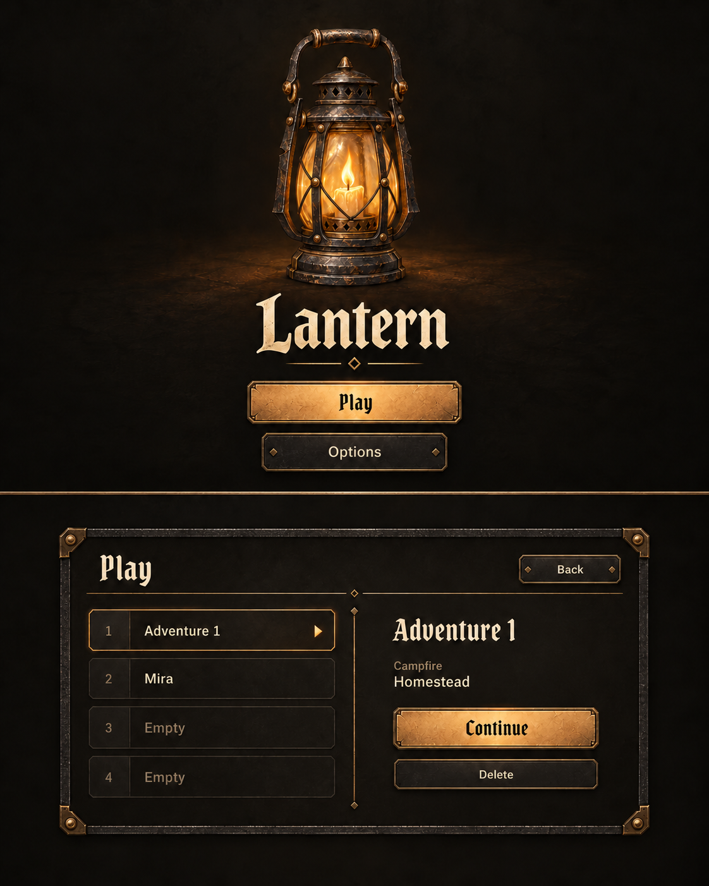

# Title and Play

Adopted October 3, 2026: Option A, with **Play** replacing Adventures on both the Title button and slot-screen heading. Status: implemented and inspected in an owned native-WebGPU preview at 1280 × 800.

## Brief and adopted composition

Player goal: start a fresh named character, continue an existing outing, switch between four independent adventures, or delete one intentionally. App initialization enters Title; Play opens a framed four-row list and selected details. Return to Title in gameplay Options captures progress and releases the world. Settings remain shared.

Title centers the original loading lantern above the Pirata One Lantern heading and stacked Play/Options controls. Play uses blackened iron surfaces, restrained brass joins, ivory text, a selected row marker and warm primary emphasis. Selected details show the adventure name and authored Continue campfire. Empty slots offer New Adventure. No character portraits, classes, levels, timestamps, lore or save-status copy.

Names are trimmed, required and at most 24 Unicode code points; duplicates are allowed. New Adventure never replaces an occupied or unknown slot. Naming focuses the field; deletion identifies the adventure, explains loss of progress and focuses Cancel. Arrow keys/Home/End select rows, Tab reaches actions, Escape cancels the current dialog or returns Play to Title, and focus returns to its owning control. The supported target is 1280 × 800; reduced motion removes decorative transitions.

The UI uses actual local Pirata One and system sans-serif, live DOM text/hit areas and CSS chrome. Generated lettering and surface texture are references, not shipped raster text or functionality. Naming and deletion states are documented above; their superseded study remains in Git history.

## Original-only provenance

Built-in ImageGen, October 3, 2026. Exact prompts are in [prompts.json](prompts.json). The only initial input was the project's original [loading lantern](../../../../assets/ui/loading/PROMPT.md); later inputs were these original generated UI-only boards. No Synty/Mixamo art, gameplay capture or licensed asset was submitted. Concepts remain outside runtime imports.

| Output | Inputs / purpose | SHA-256 |
| --- | --- | --- |
| `adopted-play.png` | Option A; exact Adventures-to-Play revision, adopted | `87009fd324373fecbe50a8241ab14d4c495fa8680d2582db1c66d2a0494d1a43` |

Critique: the centered title has a clear lantern/name/action hierarchy; the contained sheet makes the four slots and selected action easy to scan. Keep quiet detail surfaces and sufficient separation for Delete. CSS frames deliberately stay lighter than the illustrative oversized rivets. Exact typography, contrast, hit areas and behavior require DOM inspection.

## Ownership and recovery

[Application](../../../../src/application.ts), [front-end](../../../../src/ui/front-end.ts), [styles](../../../../src/ui/front-end.css), [store](../../../../src/gameplay/adventure-store.ts) and [session](../../../../src/session/session.ts) own the implementation. [Save recovery](../../../RUNTIME.md#save-recovery) owns the silent policy.

Save errors are invisible. Valid backups recover automatically; writes retry while the latest per-slot snapshots remain in memory across Title and switching. Unknown/unreadable slots remain protected and failed Continue returns quietly to Play. Closing before successful persistence can lose pending changes. Graphics/art preparation failures still offer Retry/Back.

Test rationale: migration can overwrite existing progress, stale callbacks can resurrect a deleted adventure, and session departure can discard a pending outing. Existing single-character tests lack slot identity and application-lifetime retries. Focused storage-boundary tests protect those consequences without GPU fixtures or browser infrastructure.

## Inspection

October 3, 2026: the owned normal-settings preview created Rowan, Mira, Ash and Lark at Homestead and continued all four through Title without state leakage. Cancelled deletion retained the adventure with focus on Delete; confirmed deletion remained empty after reload despite retained legacy bytes. Names trim correctly. A forced write failure retained the newer outing for Continue without warnings; restored writes persisted it. Required character-art failure offered Back and Retry, with successful native gameplay after recovery. Legacy backup migration retained 79 gold and the outing; an invalid checkpoint resumed at Homestead with full health. Shared graphics feedback was checked through the persistent scene mount after switching. Initial focus, four-row selection and supported-size composition were inspected; inactive slot boundaries were strengthened for readability.

Focused storage tests protect interrupted migration, four-slot isolation, pending snapshots, backup preservation, unreadable legacy/new-slot protection, known-memory recovery and deletion/recreation. The existing character/outing fixtures also passed. A development hot-reload preparation stall recovered through owned browser navigation; the underlying existing loader issue remains unverified and is recorded in the friction log. Broader platform, controller and performance validation remain outside this task. Private captures: `.local/play-first.png` and `.local/play-four.png`.
